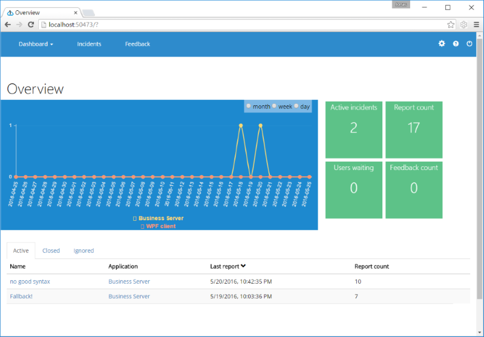

OneTrueError
================================

OneTrueError is an open source error handling service for .NET. It includes the context information that you forgot to include when you logged/reported the exception.

[Getting started guide](https://www.codeproject.com/articles/1126297/onetrueerror-automated-exception-handling)

## Love or hate our service? 

Please write a review.

* [G2 Crowd](https://www.g2crowd.com/products/onetrueerror/reviews)

## Licensing

* Server: AGPL
* Client libraries: Apache 2.0
