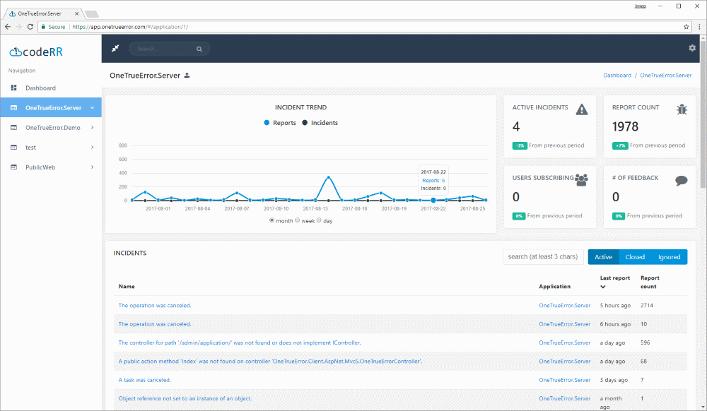

codeRR Community Server
=============================

[]() []()

codeRR discovers and analyzes all exceptions in all of your installations for every version of your .NET application.



.. don't want to host/maintain your own server? Try [codeRR Live](https://coderrapp.com/live/)

## What's in it for me?

codeRR monitors your application and notifies you when new unique errors occurs, putting an end to random logfile scanning and relying on reports from users.

You can typically solve the incident straight way, since codeRR provides relevant information together with the exception. In your codeRR server you can do further analysis of systematic and related errors.

In short, we believe that codeRR will save you time and effort and help you improve code quality

[Read more...](https://coderrapp.com)

## Getting started

Once you have installed the server you need to install one of our nuget packages in your application. 
You can read more about them [here](https://coderrapp.com/documentation/).

Unhandled exceptions will be picked up by the client libraries. 

To report exceptions yourself:

```csharp
public void UpdatePost(int uid, ForumPost post)
{
	try
	{
		_service.Update(uid, post);
	}
	catch (Exception ex)
	{
		OneTrue.Report(ex, new{ UserId = uid, ForumPost = post });
	}
}
```

The context information will be attached as:


[Read more...](https://coderrapp.com/features/)

## Community

* [Discussion board](http://discuss.coderrapp.com)
* [Report bugs](https://github.com/coderrapp/coderr.server/issues)
* [Documentation](https://coderrapp.com/documentation)
* [Commercial support](mailto:support@coderrapp.com?subject=Commercial%20support%20inquiry)

## Licensing

* Community Server: [AGPL](License)
* Client libraries: [Apache 2.0](https://opensource.org/licenses/apache-2.0)
* [codeRR Live](https://coderrapp.com/live): Commercial
* [codeRR OnPremise](https://coderrapp.com/live): Commercial
