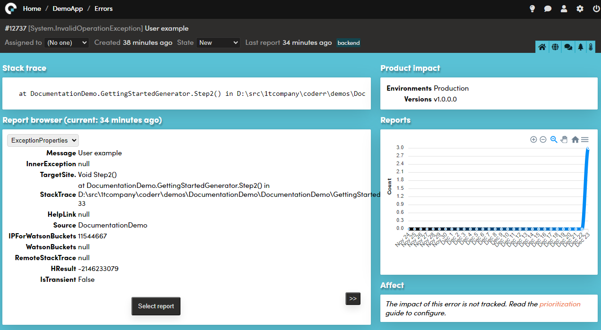
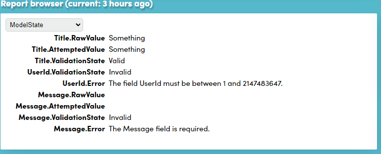

Coderr Community Server
=============================

[]() []()

# Solve errors more quickly

It works on my machine!

We all have heard, and said, that expression. Solving errors can be quite frustrating. Even trivial errors which just takes a few minutes to solve can cause frustration if there are many of them.

Coderr automates the error management process. Let Coderr detect, report and analyze the errors, so that you can focus on just solving them.



## Search function


.. don't want to host/maintain your own server? Try [Coderr Cloud](https://lobby.coderr.io/?utm_source=github) - Free up to five users.

## Getting started

1. [Download Coderr Server](https://github.com/coderrio/Coderr.Server/releases), use our [cloud service](https://lobby.coderr.io) (free for up to five users) or use our [Docker image]()
2. Install one of our [nuget libraries](https://www.nuget.org/packages?q=coderr.client) (or one of the [js libraries](https://www.npmjs.com/package/coderr.client)).
3. Follow the instructions in the package ReadMe (max three lines of code to get started).
4. Try the code below.

**Unhandled exceptions will automatically be reported by the client libraries.**

To report exceptions manually:

```csharp
public void UpdatePost(int uid, ForumPost post)
{
	try
	{
		_service.Update(uid, post);
	}
	catch (Exception ex)
	{
		Err.Report(ex, new{ UserId = uid, ForumPost = post });
	}
}
```

Sample data collected by the ASP.NET Core MVC library:



You can learn more about reporting errors [here](https://coderr.io/documentation/getting-started).

## Running Coderr

You can run any Coderr in development, test and in production. Coderr is available in three different ways; as Coderr Community Server (AGPL license, self-hosting), as Coderr Cloud (commercial license, cloud version) or on request, as Coderr Premise (commercial license, self-hosting version). Coderr Cloud and Coderr Premise add powerful algorithms to prioritize errors and provide insight to how your code is improving over time with applied solutions.

[Read more](https://coderr.io/features/)


## About us

We are passionate about Open Source, Microsoft .NET and code quality. 1TCompany started in 2017 in Sweden and builds on years of coding experience and bringing products to market. Our mission is to assist fellow developers deliver quality code. To accomplish this mission, we decided to make Coderr commercially available and ready for prime time.


## Community

* [Discussion board](http://discuss.coderr.io)
* [Report bugs](https://github.com/coderr.io/coderr.server/issues)
* [Documentation](https://coderr.io/documentation)
* [Commercial support](mailto:support@coderr.io?subject=Commercial%20support%20inquiry)

## Licensing

* Community Server: [AGPL](License)
* Client libraries: [Apache 2.0](https://opensource.org/licenses/apache-2.0)
* [Coderr Cloud](https://lobby.coderr.io): Commercial
* [Coderr Premise](https://coderr.io/features): Commercial
