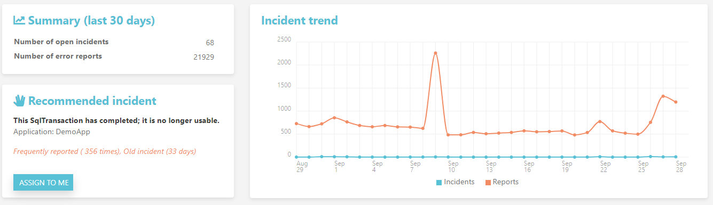
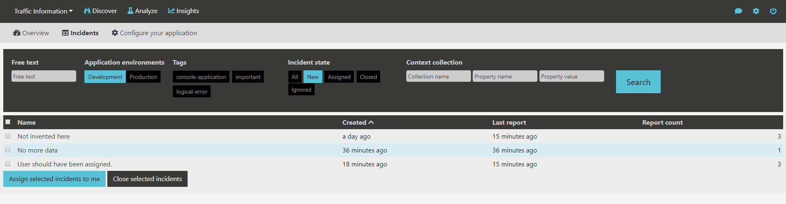

Coderr Community Server
=============================

[]() []()

# Discover more errors and solve them faster!




## Search function



.. don't want to host/maintain your own server? Try [Coderr Live](https://coderr.io/live/)

## What’s Coderr?

Coderr is an error handling tool developed specifically for .NET applications. Coderr provides an insight to all errors that are occurring and gives you control and a complete view of your applications’ status. 

## Why change?

Too often, error detection and management involves relying on reports from users and random logfile scanning. The unknown amount of errors and weaknesses of the code creates uncertainty and lessens your control. With a systematic approach facilitated by a tool built for developers by developers, Coderr provides insight about the status of the applications. 


## Getting started

Once you have [downloaded and installed the server](https://github.com/coderrio/Coderr.Server/releases) you need to install and configure one of our nuget packages. You can read more about them [here](https://coderr.io/documentation/client/).

**Unhandled exceptions will automatically be reported by the client libraries.**

To report exceptions manually:

```csharp
public void UpdatePost(int uid, ForumPost post)
{
	try
	{
		_service.Update(uid, post);
	}
	catch (Exception ex)
	{
		Err.Report(ex, new{ UserId = uid, ForumPost = post });
	}
}
```

The context information will in this case be attached as:


You can learn more about reporting errors [here](https://coderr.io/documentation/).

## Running Coderr

You can run any Coderr in development, test and in production. Coderr is available in three different ways; as Coderr Community Server (AGPL license, self-hosting), as Coderr Live (commercial license, cloud version) or on request, as Coderr running on premise (commercial license, self-hosting version). Coderr Live and Coderr on premise add powerful algorithms to prioritize errors and provide insight to how your code is improving over time with applied solutions. Coderr was rebranded and developed from OneTrueError in 2017.

[Read more](https://coderr.io/features/)


## About us

We are passionate about Open Source, Microsoft .NET and code quality. 1TCompany started in 2017 in Sweden and builds on years of coding experience and bringing products to market. Our mission is to assist fellow developers deliver quality code. To accomplish this mission, we decided to make Coderr commercially available and ready for prime time.


## Community

* [Discussion board](http://discuss.coderr.io)
* [Report bugs](https://github.com/coderr.io/coderr.server/issues)
* [Documentation](https://coderr.io/documentation)
* [Commercial support](mailto:support@coderr.io?subject=Commercial%20support%20inquiry)

## Licensing

* Community Server: [AGPL](License)
* Client libraries: [Apache 2.0](https://opensource.org/licenses/apache-2.0)
* [Coderr Live](https://coderr.io/live): Commercial
* [Coderr OnPremise](https://coderr.io/features): Commercial
